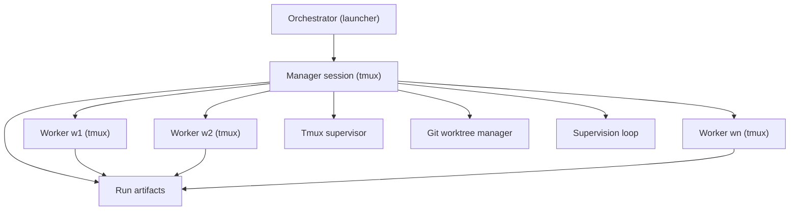

# mminions

Manager-first bug repro + triage system with Codex workers in tmux.

## Requirements
- Python 3.11+
- `codex`
- `tmux`
- `git`

## Hierarchy
1. `orchestrator.manager` is the entrypoint and orchestrator.
2. Worker sessions (`w1`, `w2`, ...) are executors launched and supervised by manager.
3. `orchestrator.run` is an optional compatibility launcher that starts manager in a tmux session.

Role details: [`docs/responsibilities.md`](docs/responsibilities.md)



## Manager (entrypoint)
GitHub issue run commands:
```bash
python3 -m orchestrator.manager \
  --issue-url https://github.com/numpy/numpy/issues/30272
```

```bash
python3 -m orchestrator.manager \
  --issue-url https://github.com/numpy/numpy/issues/30272 \
  --workers 2
```

Simple (uses defaults from `mminions.toml`):
```bash
python3 -m orchestrator.manager \
  --issue-url https://github.com/numpy/numpy/issues/30272
```

Explicit (override defaults):
```bash
python3 -m orchestrator.manager \
  --run-id run-$(date -u +%Y%m%d%H%M%S) \
  --issue-url https://github.com/<owner>/<repo>/issues/<number> \
  --repo-path /absolute/path/to/repo \
  --runs-root /absolute/path/to/runs \
  --workers 2 \
  --timeout-sec 300
```

Advanced configuration:
- Edit [`mminions.toml`](mminions.toml).
- Or pass a custom config file with `--config /absolute/path/to/mminions.toml`.
- Model routing:
  - `worker_model` for repro/triage workers (fast model recommended).
  - `manager_model` for manager-side semantic reduction (reasoning model recommended).
  - For ChatGPT Codex accounts, `gpt-5` and `gpt-5.2-codex` are supported. `gpt-5-mini` is not supported.

Manager stdout behavior:
- Streams phase progress and worker status transitions (`running`, `finished`, `failed`, `timeout`).
- Prints a final human-readable summary with status, rationale, top hypotheses, next fix targets, and token/timing metrics.
- Keeps machine-readable metrics in `runs/<run_id>/decision.json` under `metrics`.

## Optional launcher
Use this only if you specifically want a wrapper that creates the manager tmux session for you.
```bash
python3 -m orchestrator.run \
  --issue-url https://github.com/<owner>/<repo>/issues/<number> \
  --repo-path /absolute/path/to/repo \
  --runs-root /absolute/path/to/runs \
  --workers 2 \
  --timeout-sec 300
```

## CLI
```bash
python3 -m orchestrator.cli status --run-id <run_id> --runs-root /absolute/path/to/runs
python3 -m orchestrator.cli attach --run-id <run_id> --worker manager --runs-root /absolute/path/to/runs
python3 -m orchestrator.cli send --run-id <run_id> --worker w1 --text "status" --runs-root /absolute/path/to/runs
python3 -m orchestrator.cli stop --run-id <run_id> --runs-root /absolute/path/to/runs
```

## Status API server
```bash
python3 -m orchestrator.server --runs-root /absolute/path/to/runs --host 127.0.0.1 --port 8088
```

Endpoints:
- `GET /health`
- `GET /api/runs`
- `GET /api/runs/<run_id>/status?lines=120`
- `POST /api/runs`
- `POST /api/runs/<run_id>/stop`
- `POST /api/runs/<run_id>/send`

### API formats

`GET /health`
Response:
```json
{
  "ok": true
}
```

`GET /api/runs`
Response:
```json
{
  "runs": ["run-20260205123000", "run-20260205124500"],
  "count": 2
}
```

`GET /api/runs/<run_id>/status?lines=120`
Response:
```json
{
  "run_id": "run-20260205123000",
  "run_state": "running",
  "manager": {
    "session_name": "codorch-run-20260205123000-manager",
    "session_exists": true,
    "pane_tail": "last output lines...",
    "issue_url": "https://github.com/<owner>/<repo>/issues/<number>"
  },
  "workers": [
    {
      "worker_id": "w1",
      "role": "REPRO_BUILDER",
      "status": "finished",
      "session_name": "codorch-run-20260205123000-w1",
      "session_exists": false,
      "worktree_path": "/tmp/mminions-run-20260205123000-w1",
      "output_path": "/absolute/path/to/runs/run-20260205123000/repro/candidates/w1.json",
      "script_path": "/absolute/path/to/runs/run-20260205123000/scripts/repro-w1.sh",
      "pane_tail": ""
    }
  ],
  "summary": {
    "total": 1,
    "active": 0,
    "finished": 1,
    "failed": 0,
    "timeout": 0,
    "unknown": 0
  },
  "decision": {
    "status": "running"
  },
  "run_done": {}
}
```

`POST /api/runs`
Request:
```json
{
  "issue_url": "https://github.com/<owner>/<repo>/issues/<number>",
  "repo_path": "/absolute/path/to/repo",
  "workers": 2,
  "timeout_sec": 300
}
```
Response:
```json
{
  "run_id": "run-20260205123000",
  "run_done": "/absolute/path/to/runs/run-20260205123000/run_done.json",
  "manager_session": "codorch-run-20260205123000-manager"
}
```

`POST /api/runs/<run_id>/stop`
Response:
```json
{
  "run_id": "run-20260205123000",
  "status": "stopped"
}
```

`POST /api/runs/<run_id>/send`
Request:
```json
{
  "worker": "w1",
  "text": "status"
}
```
Response:
```json
{
  "run_id": "run-20260205123000",
  "worker": "w1",
  "sent": true
}
```

## Artifacts
`runs/<run_id>/`
- `issue.json`
- `sessions.json`
- `repro/candidates/*.json`
- `repro/minimal_repro.*`
- `triage/hypotheses.json`
- `decision.json`
- `final.md`
- `run_done.json`

## Tests
```bash
python3 -m unittest discover -s tests -p 'test_*.py'
```

## NumPy worktree bug-fix eval
Offline (PR-gate deterministic):
```bash
uv run --with pytest pytest tests/evals/test_numpy_convolve_offline.py tests/evals/test_numpy_convolve_live.py
```

Live (opt-in, full runtime build + codex fix):
```bash
MMINIONS_RUN_LIVE_EVAL=1 \
uv run --with pytest pytest -m live_eval tests/evals/test_numpy_convolve_live.py
```

Direct CLI:
```bash
python3 -m orchestrator.eval_numpy_convolve \
  --mode offline \
  --numpy-repo-path /absolute/path/to/numpy \
  --runs-root /absolute/path/to/runs
```

```bash
python3 -m orchestrator.eval_numpy_convolve \
  --mode live \
  --numpy-repo-path /absolute/path/to/numpy \
  --runs-root /absolute/path/to/runs \
  --python-version 3.12 \
  --max-runtime-sec 1800
```

Eval artifacts:
`runs/<eval_run_id>/`
- `metadata.json`
- `before_oracle.json`
- `after_oracle.json` (live mode)
- `reference_oracle.json` (live mode)
- `codex_output.txt` (live mode)
- `candidate.patch` (live mode)
- `candidate_patch_validation.json` (live mode)
- `summary.json`
